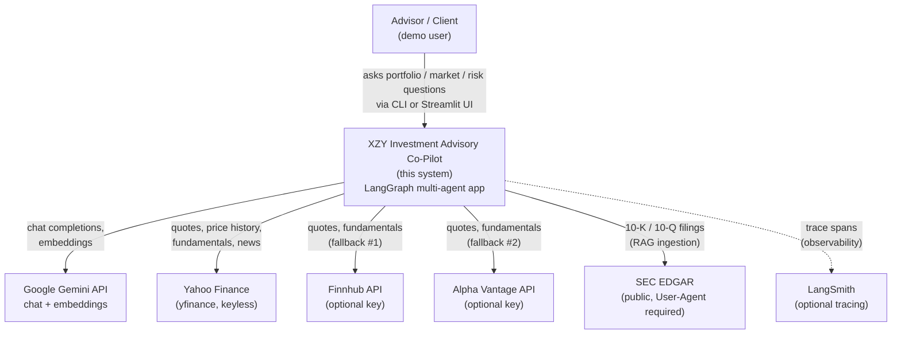
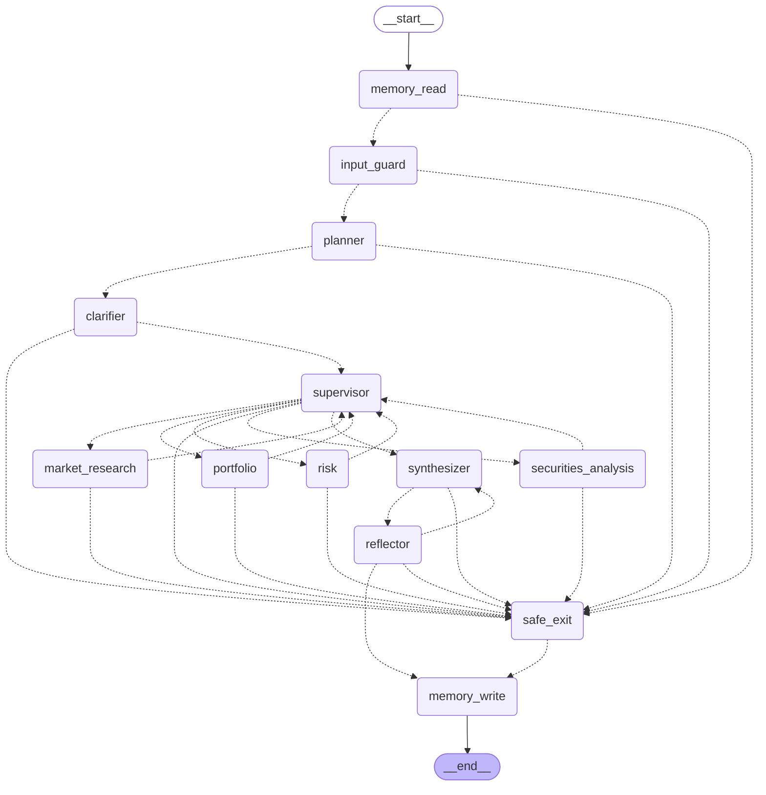

# Architecture — XZY Investment Advisory Co-Pilot

A multi-agent investment advisory system built on **LangGraph**, powered exclusively by **Google Gemini** (chat + embeddings — no OpenAI/Anthropic anywhere in the stack).

## 1. System Context (C4 Level 1)

Who talks to the system, and what it talks to.



The system has exactly **one required external dependency**: `GOOGLE_API_KEY` (Google AI Studio, free tier). Every other integration degrades gracefully — yfinance needs no key at all and is the guaranteed-available floor of the market-data chain; Finnhub/Alpha Vantage/LangSmith are optional enrichments.

## 2. Container Diagram (C4 Level 2)

```mermaid
graph TD
    subgraph clients["Entry points"]
        cli["CLI<br/>app/cli.py<br/>argparse + streaming"]
        ui["Streamlit UI<br/>ui/streamlit_app.py<br/>client selector, chat, panels"]
    end

    subgraph core["LangGraph Application (single Python process)"]
        graph["Compiled StateGraph<br/>app/graph/builder.py<br/>15 nodes — see §3"]
        agents["4 specialist agents<br/>app/agents/*.py<br/>react-style, LangChain create_agent"]
        tools["Tool registry<br/>app/tools/registry.py<br/>25 tools across 3 agents"]
        guardrails["Guardrail pipelines<br/>app/guardrails/*.py<br/>input + hallucination"]
    end

    subgraph data["Data layer"]
        excel[("portfolios.xlsx +<br/>synthetic_supplement.xlsx<br/>Repository pattern")]
        chroma[("ChromaDB<br/>.chroma/<br/>SEC filings + news archive")]
        sqlite_ckpt[("SQLite: checkpoints.sqlite<br/>short-term memory<br/>per thread_id")]
        sqlite_mem[("SQLite: memory.sqlite<br/>long-term memory<br/>per client_id")]
        filecache[(".cache/<br/>file-backed TTL cache")]
    end

    subgraph external["External APIs"]
        gemini_ext["Google Gemini"]
        market_ext["yfinance / Finnhub /<br/>Alpha Vantage"]
        edgar_ext["SEC EDGAR"]
    end

    cli --> graph
    ui -->|"AsyncSqliteSaver via<br/>a background event loop"| graph
    graph --> agents
    graph --> guardrails
    agents --> tools
    tools --> excel
    tools --> chroma
    tools -->|"adapter chain +<br/>circuit breaker"| market_ext
    tools --> edgar_ext
    tools --> filecache
    graph <-->|"checkpoint every step"| sqlite_ckpt
    graph <-->|"read on entry,<br/>write on exit"| sqlite_mem
    agents --> gemini_ext
    guardrails -->|"LLM-judge guards"| gemini_ext
    chroma -.->|"embeddings"| gemini_ext
```

Everything runs as one Python process — no microservices, no message queue. The CLI and Streamlit UI are two thin front-ends over the same compiled graph; they differ only in which checkpointer they inject (`SqliteSaver` for the CLI/notebooks, `AsyncSqliteSaver` for the UI, which drives the graph via `astream_events()`).

## 3. Agent Graph

Generated live from the compiled graph (`graph.get_graph().draw_mermaid()`, `GraphBuilder().with_all()` — every stage on) — not hand-drawn, so it can never drift from the real wiring:



Solid edges (`-->`) are static `add_edge`s; dashed edges (`-.->`) are dynamic `Command(goto=...)` routing decisions made at runtime. Almost every node in this graph routes dynamically — `safe_exit` is reachable from nearly everywhere because (Phase 11) every node is wrapped so an uncaught exception becomes a routed `Command` instead of a raw traceback.

**Textual shape:**
```
START → memory_read → input_guard → planner → clarifier → supervisor
        supervisor ⇄ (portfolio | market_research | securities_analysis | risk)
        supervisor ─(plan exhausted / done)→ synthesizer → reflector
        reflector ─(revise, ≤ MAX_REVISIONS)→ synthesizer
        reflector ─(block)→ safe_exit
        input_guard ─(block)→ safe_exit
        (reflector pass | safe_exit) → memory_write → END
```

`clarifier` may **pause** the graph mid-run via `interrupt()` — the checkpointer persists the paused state, control returns to the caller (CLI prompt / UI buttons), and `Command(resume=answer)` continues execution exactly where it left off.

## 4. Inter-Agent Communication Protocol

The brief explicitly requires "effective inter-agent communication protocols" — this is the single most important architectural decision in the system, so it gets its own section.

**Agents never call each other.** There is no agent-to-agent RPC, no shared object references, no direct function calls between `PortfolioAgent` and `SecuritiesAnalysisAgent`. The *only* channel between agents is `AgentState` (`app/graph/state.py`) — a `TypedDict` that LangGraph threads through every node:

```python
class AgentState(TypedDict, total=False):
    messages: Annotated[list[AnyMessage], add_messages]  # the shared transcript
    client_id: str
    route: Optional[str]              # supervisor's routing decision
    hops: int; visited: list[str]     # loop guards
    plan: Optional[list[dict]]        # planner's ordered sub-goals
    plan_step: int
    final_answer: Optional[str]
    revisions: int
    guardrail_events: list
    tool_results: dict                # every specialist's raw tool output, keyed by agent name
    retrieved_context: list[str]      # RAG snippets, for groundedness auditing
    needs_clarification / clarification_answer: Optional[str]
```

This is a deliberate **blackboard architecture**: every specialist reads what it needs from state and writes back only its own contribution; nothing is destroyed, everything accumulates for the turn. Concretely:

- `messages` is the shared transcript — a specialist's `AIMessage`/`ToolMessage`s become visible to every later node in the same run (the synthesizer reads them; the next specialist in a plan sees them as prior context).
- `tool_results[agent_name]` is the **audit trail** — the guardrail pipeline (`NumericConsistencyGuard`) cross-checks every number in the final answer against this dict, so an agent literally cannot get away with a hallucinated figure downstream.
- `retrieved_context` is the RAG evidence pool — populated by `BaseAgent._postprocess` whenever a `search_filings`/`search_news_archive` tool fires, consumed by `GroundednessGuard`.

**The supervisor is the sole scheduler.** `SupervisorAgent.run()` (`app/agents/supervisor.py`) is the only component in the entire graph that decides *who runs next*. It has two modes:
- **Plan mode** (`state.plan` is set): the supervisor is a tiny **interpreter** — it walks `plan[plan_step]` one step at a time, in the order the planner decomposed the query, and hands each specialist a focused `SystemMessage` naming just that step's sub-goal.
- **Simple mode** (no plan): it consults a swappable `RoutingStrategy` (LLM or keyword) once per turn, deduplicates against `visited` so no specialist runs twice, and caps total hops at `MAX_HOPS=4`.

**The handoff mechanism is `Command(goto=..., update=...)`** — a LangGraph primitive, not a custom message-passing layer. Every dynamic edge in §3's diagram is one agent (or the supervisor) returning a `Command` naming the next node and the state delta it's contributing. This is what makes the protocol *inspectable and replayable*: `state["plan"]` and `state["guardrail_events"]` are a complete, structured log of who did what, in what order, and why — recoverable from any checkpoint.

**Why this shape, not direct calls:** (1) it makes the system's control flow a first-class, checkpointable state machine — `interrupt()`/resume, mid-run crash recovery, and time-travel debugging all fall out of using LangGraph's state mechanism instead of ad hoc coroutine calls; (2) it enforces a hard boundary — an agent literally has no handle to call another agent even if its prompt were compromised (see the access-control interceptor in §6, which is the second half of this same story for *data*, not control flow); (3) new specialists are additive — `GraphBuilder.with_risk_agent()` adds a node and a routing option, and existing agents need zero changes because none of them know the new agent exists.

## 5. Data-Flow Tables (per node)

| Agent / Node | Inputs (from state) | Tools called | Outputs (to state) |
|---|---|---|---|
| **memory_read** | `client_id`, `session_id` | none (`MemoryStore.get_recent_decisions`, direct SQLite) | resets `hops`/`visited`/`route`; injects a `SystemMessage` with prior-session context |
| **input_guard** | latest `HumanMessage` | none (regex + pattern guards) | `guardrail_events`; redacts PII in place; on block → `blocked` + routes to `safe_exit` |
| **planner** | latest `HumanMessage`, agent menu | `get_llm()` (complexity classifier + decomposition, if LLM strategy) | `plan` (ordered `[{agent, goal}]`) or empty (simple mode); resets per-turn scratch state |
| **clarifier** | `client_id`, query, `portfolio_repo.get()` for holdings | `get_llm()` (ambiguity judge) | may `interrupt()` (pause); on resume, `clarification_answer` + a synthetic `HumanMessage` |
| **supervisor** | `plan`/`plan_step` or `messages` (routing) | none directly (delegates to `RoutingStrategy`, which may call `get_llm()`) | `route`, `hops`, `visited`, `plan_step`; `Command(goto=<agent>\|synthesizer\|END)` |
| **portfolio** | `messages`, `client_id` | `get_holdings`, `get_portfolio_value`, `get_position`, `get_position_performance`, `get_ytd_returns`, `get_allocation_by_sector`, `get_allocation_by_asset_class`, `get_allocation_by_market_cap` | new `AIMessage`/`ToolMessage`s; `tool_results["portfolio"]` |
| **market_research** | `messages`, `client_id` (context only — no holdings access) | `get_market_snapshot`, `get_recent_news`, `get_sector_performance`, `get_economic_indicators`, `search_filings`, `search_news_archive` | new messages; `tool_results["market_research"]`; `retrieved_context` (if RAG tools fired) |
| **securities_analysis** | `messages`, `client_id` | `check_holding`, `technical_analysis`, `compare_indicators`, `search_filings`, `search_news_archive` | new messages; `tool_results["securities_analysis"]`; `retrieved_context` |
| **risk** | `messages`, `client_id` | `portfolio_volatility`, `portfolio_beta`, `value_at_risk`, `concentration_metrics`, `risk_tolerance_check`, `regulatory_flags` | new messages; `tool_results["risk"]` |
| **synthesizer** | `messages`, `tool_results`, `plan`, pending `REVISION REQUIRED` critique | `get_llm(reasoning=True)` (Chain-of-Thought) | `final_answer`; a new `AIMessage(name="synthesizer")` |
| **reflector** | `final_answer`, `tool_results`, `retrieved_context` | `get_llm(reasoning=True)` (2 of 4 guards are LLM judges) | `guardrail_events`; either passes through, loops to `synthesizer` with a critique (`revisions += 1`), or blocks to `safe_exit` |
| **safe_exit** | `blocked` | none | overwrites `final_answer` with the honest apology text; always non-technical |
| **memory_write** | `messages` (query + answer), `visited` | none (`MemoryStore.save_decision`, direct SQLite) | none (terminal; best-effort, swallows its own errors) |

## 6. Decision-Making Narrative — Worked Example

**Query:** *"technical analysis on my NVDA position"*, client `CLT-005` (holds NVDA — verified against `portfolios.xlsx`; CLT-003/001/004 hold no individual stocks and would correctly fail this same query with "you don't hold that").

This is a real, live trace (`notebooks/phase14_ui_smoke.ipynb`, `REASONING_MODEL_NAME=gemini-3.1-flash-lite`), not a hypothetical:

1. **`memory_read`** finds 4 prior decisions for CLT-005 and injects a "prior context" system note (skipped on the very first session for a client).
2. **`input_guard`** runs `pii` → `prompt_injection` → `scope`, all pass — nothing to redact or block.
3. **`planner`** classifies the query as complex (it names both a holding *and* asks for a specialist analysis) and decomposes it into a 2-step plan:
   `[{portfolio: "Retrieve the client's current NVDA position details…"}, {securities_analysis: "Perform technical analysis on NVDA, including RSI, moving averages…"}]`
4. **`clarifier`** finds no genuine ambiguity ("my NVDA position" is unambiguous) — passes straight through, no `interrupt()`.
5. **`supervisor`** (plan mode, step 1/2) dispatches **`portfolio`**. It calls `get_position`/`get_quote`-backed tools; the adapter chain serves the quote from **Finnhub** (first in the chain, has a configured key); a second call for the same symbol within 60s hits the file cache (`cache_hit`, age 6.1s) instead of a second network call. Returns: 150 shares, current price $208.92, cost basis at $21.578/share (a large unrealized gain).
6. **`supervisor`** (step 2/2) dispatches **`securities_analysis`**. It first calls `check_holding` (confirms CLT-005 holds NVDA — required by its system prompt before analysing anything), then `technical_analysis`. That tool needs price history: the chain tries **Finnhub** → fails (`"price history requires a paid plan"`) → tries **Alpha Vantage** → fails (`"period '6mo' unsupported on free tier"`) → falls to **yfinance** → succeeds. This is the Chain-of-Responsibility adapter fallback working exactly as designed, live, not simulated.
7. **`supervisor`** sees the plan is exhausted (`plan_step == len(plan)`) and hands off to **`synthesizer`**.
8. **`synthesizer`** (reasoning-tier Gemini) composes one answer from both specialists' tool evidence — position sizing and gain from `portfolio`, RSI/moving-average readings from `securities_analysis` — citing every number.
9. **`reflector`** runs its 4-guard pipeline: `numeric_consistency` (every number in the answer traces to `tool_results`) → `conflict_disclosure` (no opposing signals here, trivially passes) → `citation_coverage` (Gemini judge: all claims supported) → `groundedness` (skipped — "no retrieved context", since no RAG tool fired for this query). All pass on the first attempt (`revisions=0`).
10. **`memory_write`** persists the query + final answer + `["portfolio", "securities_analysis"]` to long-term memory, so the *next* CLT-005 session opens already knowing this happened.

**A second real trace** (same client, "What do I own?", simple routing mode) shows the *other* branch of step 9: `citation_coverage` caught the synthesizer mis-classifying AMZN/TSLA as "Technology" sector on attempt 1, and META's sector on attempt 2 — the reflector looped back to the synthesizer twice with the exact critique each time before a 3rd attempt shipped, and would have shipped best-effort with a logged warning had it hit `MAX_REVISIONS=2` without passing. This is the hallucination-guardrail loop catching a real (not staged) error live.

## 7. External Integrations

| Adapter | External API | Auth | Rate limit (free tier) | Fallback if unavailable |
|---|---|---|---|---|
| `FinnhubAdapter` | Finnhub REST | `FINNHUB_API_KEY` (optional) | 60 req/min | `available()` reports `False` if no key → chain skips to next adapter |
| `AlphaVantageAdapter` | Alpha Vantage REST | `ALPHA_VANTAGE_API_KEY` (optional) | 25 req/day | Same — `available()` gates on the key |
| `YFinanceAdapter` | Yahoo Finance (via `yfinance`) | none (keyless) | unofficial/best-effort | Always available — the chain's guaranteed final rung; system runs fully with zero optional keys |
| `NewsAdapter` | Finnhub → yfinance (its own quality-ordered mini-chain) | inherits above | inherits above | Returns an honest "no news available" payload rather than fabricating headlines |
| `SECEdgarAdapter` | SEC EDGAR full-text search + filing index | none — requires a descriptive `User-Agent` header (`SEC_USER_AGENT` = name + email) | self-imposed 5 req/s (EDGAR allows ~10/s) | `@retry(max_attempts=3)`; ingestion is a one-time batch job, not a live-query dependency |
| **Google Gemini** | `langchain-google-genai` | `GOOGLE_API_KEY` (the one required secret) | ~10 req/min (client-side `InMemoryRateLimiter` throttles to `GEMINI_CALLS_PER_MINUTE=8` before sending); daily per-model caps vary (e.g. `gemini-2.5-flash` = 20 req/day observed) | None — Gemini is a hard dependency for every reasoning/embedding call in this project; there is deliberately **no OpenAI/Anthropic fallback path**, by design constraint, not oversight |
| **LangSmith** | LangSmith tracing API | `LANGSMITH_API_KEY` (optional) | n/a (observability only) | If unset, the app runs identically with no tracing — it is a pure side channel, never on the request's critical path |

**On the "Gemini is the only LLM/embedding provider" constraint:** every chat and embedding call in this codebase is issued from exactly one place, `app/llm/factory.py` (`get_llm()` / `get_embeddings()`), which asserts `settings.LLM_PROVIDER == "gemini"` at call time as a belt-and-braces check on top of `Settings`' own field validator rejecting any other provider at startup. This includes the RAGAS evaluation judge (Phase 13), which required deliberately choosing RAGAS's older `LangchainLLMWrapper`/`LangchainEmbeddingsWrapper` API over its newer OpenAI-shaped `llm_factory` API to keep the Gemini-only constraint intact end to end.
